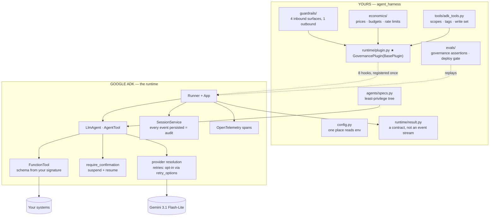
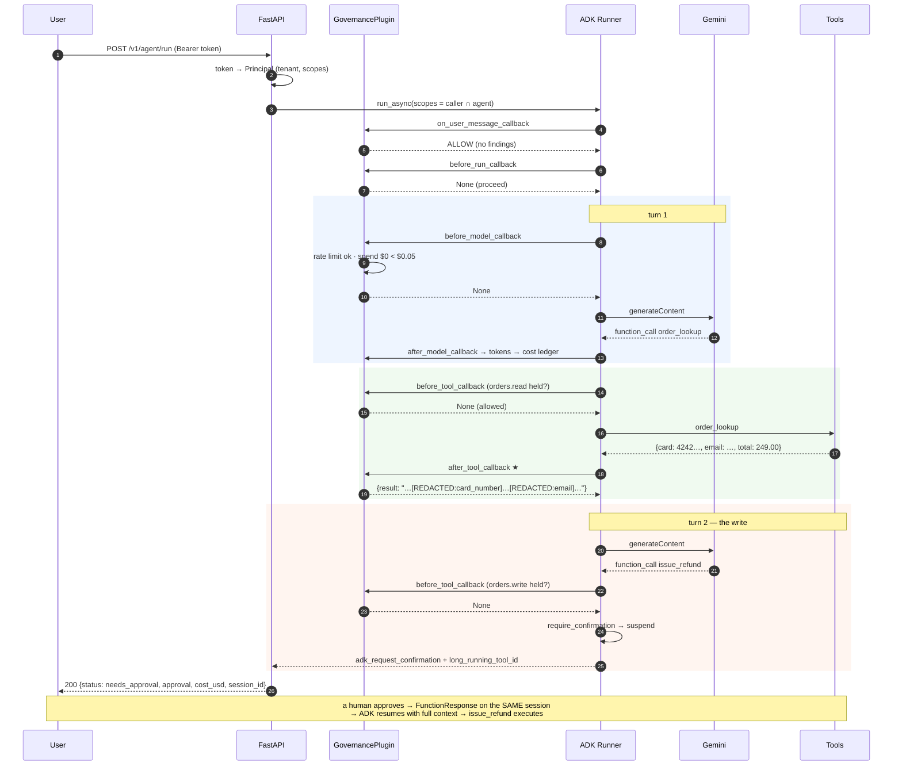
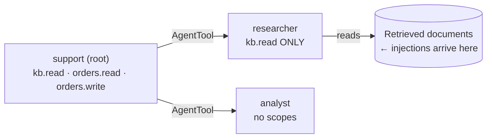
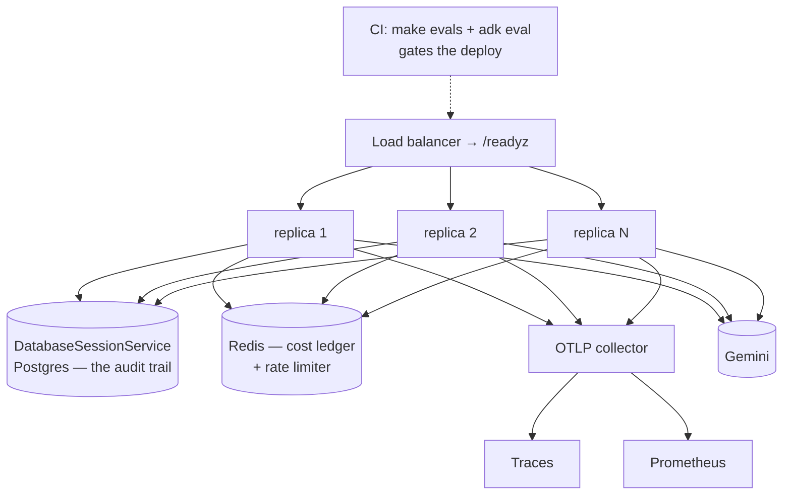

# Architecture

## The one-sentence version

Google ADK runs the agent. This project is the governance around it — the part
no framework can ship, because half of it encodes decisions only your
organisation can make: what counts as sensitive, what needs a human, what you
are willing to spend, and what "correct" means for your business.

---

## Where the line falls

**Read the dotted line from `plugin.py` as the whole product.** One object,
registered on the Runner, intercepts every model call and every tool call in
every agent of the tree. It cannot be forgotten on a subtree, which is the
difference between governance and a convention.

---

## The eight hooks, and what each one is for

| Hook | Governance job | Why *this* hook |
|---|---|---|
| `on_user_message_callback` | input rails — redact | returning `Content` replaces the user message |
| `before_run_callback` | input rails — **block** | returning `Content` short-circuits the run, **before any model call**, so a blocked request is free |
| `before_model_callback` | rate limit, **spend ceiling** | returning `LlmResponse` skips the call, so a budget refusal never pays to discover it would have gone over |
| `after_model_callback` | token accounting → cost ledger; **output rails** | fires for every agent in the tree, so a subagent's answer is scanned before the parent pastes it into its own context |
| `before_tool_callback` | **scope enforcement** | returning a dict skips the tool and hands that dict back as the result |
| `after_tool_callback` | **tool-output rails** ★ | the surface that actually carries customer data and injections |
| `on_model_error_callback` | user-safe message | a provider failure must not surface a stack trace |
| `on_tool_error_callback` | failure → observation | the model usually recovers next step; raising throws away the whole run |

---

## Request walk-through

*"Refund order ORD-10021 for 249 dollars"* — this is a real trace, verified
against Gemini 3.1 Flash-Lite.

Five things happened that a bare ADK agent would not have done:

1. The caller's scopes were **intersected** with the agent's. Neither side can
   escalate the other.
2. The tool result was **scanned before it re-entered the prompt**. That is
   where the card number was removed — step ★.
3. Every model call was **priced and attributed** to an agent and a tenant.
4. The write **stopped and asked**, and the approval is bound to the session,
   so an approval id alone cannot authorise somebody else's refund.
5. The response is a **result you can branch on**, not an event stream.

---

## The least-privilege tree

`child_scopes(parent, child)` intersects, then strips every `*.write`.

The researcher is the agent that reads untrusted retrieved content. It holds no
write scopes and is handed no write tools. **If an injected instruction inside
a policy document convinces it to issue a refund, it has no refund tool to
call.** That is the defence. The injection detector is the alarm.

`AgentTool` rather than `sub_agents` transfer is deliberate: control returns to
the parent with its budget and its answer obligations intact, and the
provenance of the child's answer stays legible in the trace.

---

## Failure modes

| Failure | Handled by | Behaviour |
|---|---|---|
| Model returns malformed tool args | **ADK** | returned to the model as a correctable error |
| Model calls a tool that does not exist | **ADK** | same |
| Provider 5xx / timeout | **ADK**, if configured | retried with `agents/models.py::RETRY` (4 attempts on 408/429/5xx). ADK's default is no retry at all |
| Provider auth failure | plugin `on_model_error_callback` | user-safe message, no stack trace |
| Tool raises | plugin `on_tool_error_callback` | becomes an observation; the run continues |
| Tool output contains an injection | plugin `after_tool_callback` | withheld, with an instruction not to retry |
| Caller lacks a scope | plugin `before_tool_callback` | denied; the model adapts |
| Model-call ceiling | **ADK** `LlmCallsLimitExceededError` | mapped to `exhausted` with an honest message |
| Wall clock | harness `asyncio.wait_for` | `exhausted` |
| Spend ceiling | plugin `before_model_callback` | call skipped; `exhausted` |
| Guardrail block | plugin `before_run_callback` | `blocked`, **HTTP 200**, cost $0 |
| Write needs a human | **ADK** `require_confirmation` | `needs_approval`, resumable on the same session |

Two of these are worth stating as rules:

**A tool failure is an observation, not an exception.** Most of the time the
model recovers on the next step. Crashing discards everything spent so far.

**A guardrail block is a 200.** It is the safety system working. Returning 5xx
means your on-call is paged every time the product does its job.

---

## Deployment

What changes from the single-process default, and nothing else does:

- `AH_SESSION_DB_URL` points at Postgres. ADK's `DatabaseSessionService` does
  the rest; there is no second audit log to migrate.
- **`CostLedger` and `TokenBucket` move behind Redis.** Until they do they are
  per process, so the per-tenant daily budget resets on restart and a "60 per
  minute" limit becomes 60 per replica. Run one worker per container.
- ADK's OpenTelemetry exporter points at your collector. `/metrics` stays for
  the business counters ADK does not emit.

---

## Where each decision lives

| To change | Edit |
|---|---|
| Which model each role uses | `agents/models.py` → `build_model` |
| What an agent may see and do | `agents/specs.py` → `AgentSpec` |
| Which tools need a human | `tools/adk_tools.py` → `WRITE_TOOLS` + `require_confirmation` |
| Which scopes a tool needs | `tools/adk_tools.py` → `TOOL_SCOPES` |
| What counts as sensitive | `guardrails/detectors.py` |
| Whether a rail blocks or redacts | the rail class in `guardrails/` |
| Whether rails are advisory | `AH_GUARDRAIL_MODE` |
| Prices | `economics/pricing.py`, or `AH_PRICING_JSON` at run time |
| Any governance behaviour at all | `runtime/plugin.py` — one file |
| The agent framework | everything above, plus `runtime/harness.py`. The rails, prices, scopes and eval assertions port unchanged; the hooks do not. |
